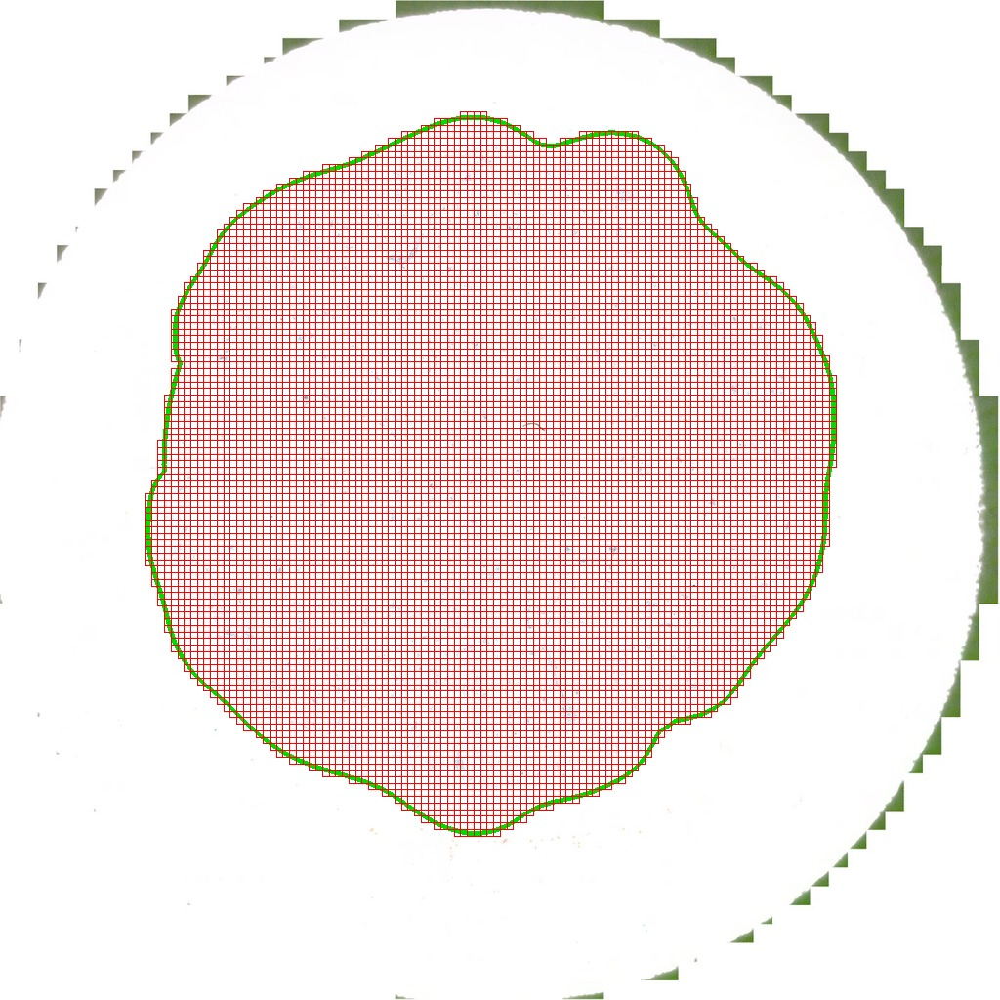
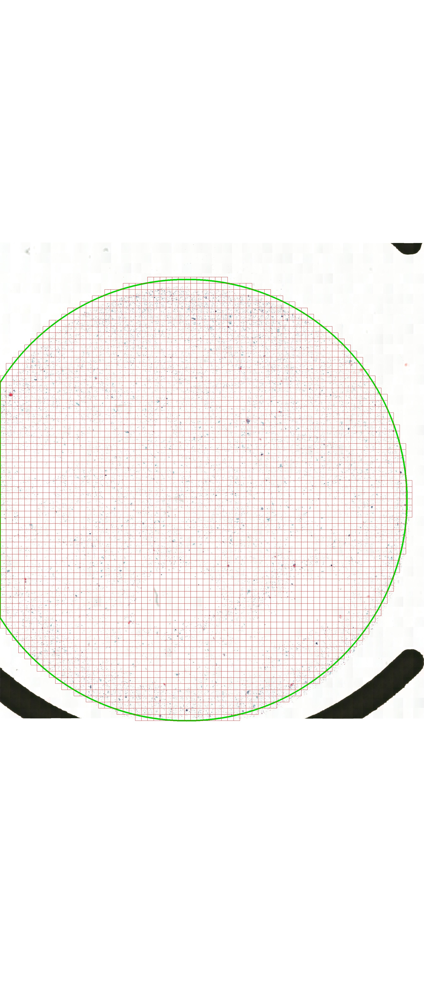

# 示例

以下示例来自 `--preview` 导出的 `contour.jpg`：绿色轮廓为 heuristic 识别的 ROI，红色网格为
计划提取的 patch 位置。

## POH：`serrated_outer_circle`

锯齿外缘的圆形涂片；`serrated_outer_circle` 先拟合高召回核心，再在锯齿边缘内做密度扩展，
最终 ROI 可呈圆、椭圆或不规则形状，并排除外层扫描锯齿。

- 配置：`configs/poh.yaml`
- Heuristic pipe：`serrated_outer_circle` → `density`（fallback）
- Patch：`600×600`，`mpp: 0.5`，`stride: 600`

## QMH：`qmh_center_circle`

中央圆形涂布区；允许圆心偏移和圆被画布截断，并排除与左右边缘连通的黑色夹具。

- 配置：`configs/qmh.yaml`
- Heuristic pipe：`qmh_center_circle`
- Patch：`600×600`，`mpp: 0.5`，`stride: 600`
